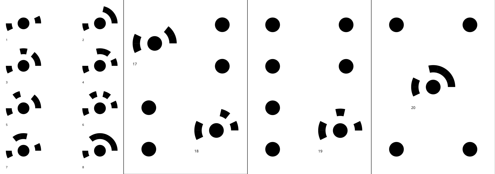

# 14-Bit-Circular-Coded-Target-Generation

Fork of: https://github.com/natowi/14-Bit-Circular-Coded-Target

    Schneider, C. T. “3-D Vermessung von Oberflächen und Bauteilen durch Photogrammetrie und Bildverarbeitung.” Proc. IDENT/VISION 91 (1991): 14-17
    
    Implementation of coding scheme of (expired) patent DE19733466A1.
    https://patents.google.com/patent/DE19733466A1/
    https://register.dpma.de/DPMAregister/pat/register?AKZ=197334660
    
    Code written by Matthew Petroff <https://mpetroff.net>, 2018

## Changes
Code was changed to generate sheets of A4 with different target configuration. 

## Detection of Targets
Detect and decode the Circular Coded Targets: https://github.com/poxiao2/CCTDecode
